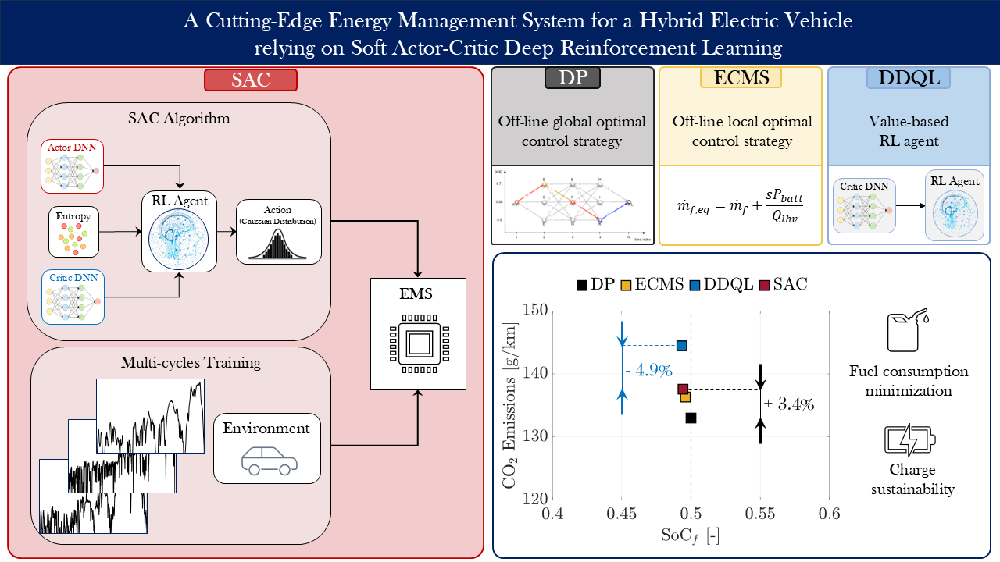

# RL-for-EMS-optimization-of-a-Simulink-based-plugin-Hybrid-Electric-Vehicle

Official implementation of the journal paper [A Cutting-Edge Energy Management System for a Hybrid Electric Vehicle relying on Soft Actor-Critic Deep Reinforcement Learning](https://www.sciencedirect.com/science/article/pii/S2666691X25000089)
published on *Transportation Engineering* in February 2025.

</td> <br/>

This repository provides the code and methodology for setting up and training a Soft-Actor Critic (SAC) and a Deep Q-Learning (DQN) Reinforcement Learning (RL) agent to optimize the energy management of a plug-in Hybrid Electric Vehicle (HEV). The implementation is built using MATLAB for the agent setting, training and testing, while two vehicle environments are available: one using an object-oriented programming approach in MATLAB, and the other in Simulink.

The repository includes detailed explanations and modular code for:

- HEV backward kinematic model approach in Simulink
- SAC algorithm implementation using the Reinforcement Learning Toolbox of MATLAB
- Training and testing procedures
- Methodology to postprocess the output of the simulation

The code is designed to be modular, allowing for 
- Easy integration of new RL agents and new policy parametrizations
- Easy customization of the vehicle model environment
- Easy integration of different reward functions

## Prerequisites
- A valid MATLAB/Simulink license is required.
- The code was tested with MATLAB R2024b, including all necessary toolboxes.

## Contents
The repository is structured in the following way:

`RL-for-EMS-optimization-of-a-Simulink-based-plugin-Hybrid-Electric-Vehicle`  
`├── testing.m`: test pre-trained RL agents <br>
`├── train.m`: main file for training RL agents <br>
`├── src/`<br>
`    ├── algos/`<br>
`        ├── SAC.m`: SAC agent definition with all parameters<br>
`        ├── DQN.m`: DQN agent definition with all parameters<br>
`        ├── ActorGaussianNet.m`: Gaussian-based policy parameterization for SAC actor<br>
`        ├── CriticNet.m`: Q-value estimator for SAC critic <br>
`        ├── CriticDQNNet.m`: Q-value estimator for DQN agent<br>
`    ├── config/`: configuration files for simulation, environment, and agents<br>
`        ├── config.json`: simulation parameters (select environment and agent type)<br>
`        ├── DQN.json`: parameters for the DQN agent<br>
`        ├── SAC.json`: parameters for the SAC agent<br>
`        └── env.py`: parameters for the vehicle environment<br>
`    ├── envs/`<br>
`        ├── SimulinkModelImages/`: images for the Simulink blocks<br>
`        ├── VehicleObjects/`: classes for each physical component of the vehicle, for the reward and states normalization<br>
`        ├── VehicleBackKinEnv.m`: backward kinematic model environment class, wrapped from MATLABEnvironment <br>
`        └── VehicleBackKin.slx`: Simulink-based backward kinematic model of the pHEV<br>
`    ├── utilities/`: helper functions<br>
`├── data/`<br>
`    ├── training_cycles.xlsx`: Excel file with training/testing driving cycles<br>
`    ├── vehicle_data.xlsx`: Excel file with vehicle parameters for the case study<br>
`    ├── DrivingCycleObjects.mat`: mat file with post-processed driving cycles from training_cycles.xlsx<br>
`    └── VehicleComponentsObjects.mat`: mat file with initialized instances of vehicle components<br>

## Configuration files
Before training or testing, select the environment and model type via the configuration file. Modify the JSON files in the `src/config/` folder as needed.

### `config.json`

Set the environment and agent type:
```
        agent_type          choose between "SAC" and "DQN" (default: "SAC")
        env_type            choose between "Matlab" and "Simulink" (default: "Simulink")
```

### `SAC.json`

Parameters for the SAC agent:
```
        agent_name          SAC agent name (default: "SAC")
        n_nodes_base_act    number of nodes for the hidden layers of the policy network (default: 32)
        n_nodes_base_cr     number of nodes for the hidden layers of the critic network (default: 32)
        lr_act              actor learning rate (default: 0.000006)
        lr_cr1              critic 1 learning rate (default: 0.0001)
        lr_cr2              critic 2 learning rate (default: 0.0001)
        ent_wgt             initial entropy weighting factor (default: 6)
        ent_trg             target entropy weighting factor (default: -1)
        ent_lr              entropy tuning learning rate (default: 0.001)
        max_episodes        training maximum number of episodes (default: 500)
        sample_time         policy sample time (default: 1)
        cycle_time          episode maximum number of steps (default: 6000)
```
### `DQN.json`
Parameters for the DQN agent:
```
        agent_name          DQN agent name (default: "DQN")
        n_nodes_base_cr     number of nodes for the hidden layers of the critic network (default: 32)
        lr_cr               critic learning rate (default: 0.001)
        max_episodes        training maximum number of episodes (default: 6000)
        sample_time         policy sample time (default: 1)
        cycle_time          episode maximum number of steps (default: 6000)
```
### `env.json`
Parameters for the vehicle environment:
```
        sample_time         sample time of the vehicle simulator (default: 1)
        multi_cycle         use multi-driving cycle training if true; otherwise false (default: "true")
        cycle_name          training driving cycle name if multi_cycle = "false" (default: "WLTC")
        reward_type         specify the reward type between "Dense", "Sparse", "SOC_BC", "ECMS" (default: "Dense")
```

## Usage

### Training

To train an agent, follow these steps:
- Modify the training parameters in the JSON file located in `src/config/`.
- Run the `training.m` script.
- After training, several plots will be generated showing the training results and an analysis of the learned policy.

### Testing

To test a pre-trained agent, follow these steps:
- Run the `testing.m` script.
- Choose a pre-trained agent from the displayed selection window.
- Select a driving cycle from the available options.
- After the simulation, plots displaying key vehicle quantities (e.g., SoC, ICE power) will be generated.

### Change additional agent parameters

To change parameters that are not specified in the configuration JSON file, you must modify the agent class directly. For example, to adjust parameters for the SAC agent:
- Open the `src/algos/SAC.m` file.
- Modify the parameters in the following methods:
  - `setActorOpts`: actor-related parameters.
  - `setCriticsOpts`: critic-related parameters.
  - `setEntropyOpts`: entropy optimizer options.
  - `setAgentOpts`: overall agent parameters.
  - `setTrainingOpts`: training-specific parameters.
  
The same approach applies to modifying parameters for the DQN agent.

### Change vehicle parameters

To change vehicle parameters:
- Delete the file `data/VehicleComponentsObjects.mat`.
- Update the `data/training_cycles.xlsx` file.
- Regenerate the file `data/VehicleComponentsObjects.mat` by running the main training script.

The same process applies if you wish to add or modify driving cycles.

### Add new agents

To add new agents:
- Create a new agent class in `src/algos/`, following the same structure as the existing agent classes.
- (Optional) If your agent needs specific policy or value networks, add the corresponding class in `src/algos/`.
- Add a configuration file for your new agent in `src/config/`.
- Update the switch statement in `src/utilities/getAgent.m` by adding a new case for your agent.
- Include the agent’s name in the *Load configuration* section of both `training.m` and `testing.m`.
